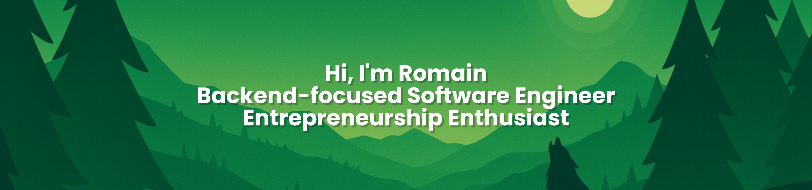

<head>
    <link rel="stylesheet" type='text/css' href="https://cdn.jsdelivr.net/gh/devicons/devicon@latest/devicon.min.css" />
</head>

#

I’m Romain — developer in Paris (42 Paris). I discovered programming at 13 through Minecraft command blocks, running small servers with friends and “scripting” contraptions. Since 2021 I’ve been coding in earnest: building small projects, deepening my algorithmic thinking, and growing an entrepreneurial mindset. I’m currently building games (Minecraft mods, Roblox) and exploring AI and Cloud.

#

  <ul style="list-style-position: outside; text-align: left;">
    <li>🌍 Paris, France · 🎓 42 Paris · 🧑‍🎓 19 y/o</li>
    <li>🎮 Building: Minecraft mods & Roblox experiences</li>
    <li>🧪 Exploring: AI · Cloud · Game Dev</li>
    <li>🤝 Open to collaborating on interesting projects</li>
  </ul>

#
<!-- 

🧠 Skills
 -->

**Core (mastered):**  

**Languages & Scripting:**  

**Frontend:**  

**Backend & Runtime:**  

**Databases:**  

**DevOps:**  

**Editors & Productivity:**  

**Operating Systems:**  

<!-- 
 -->

#

  
  
   

